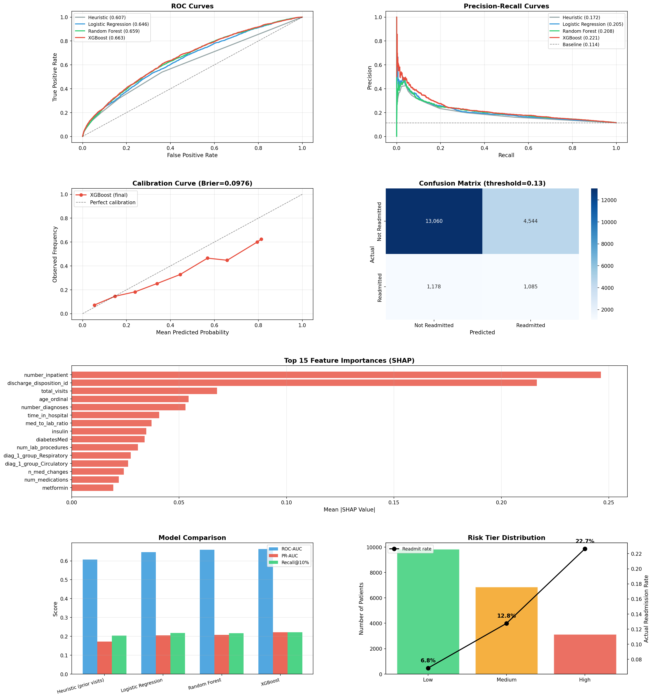
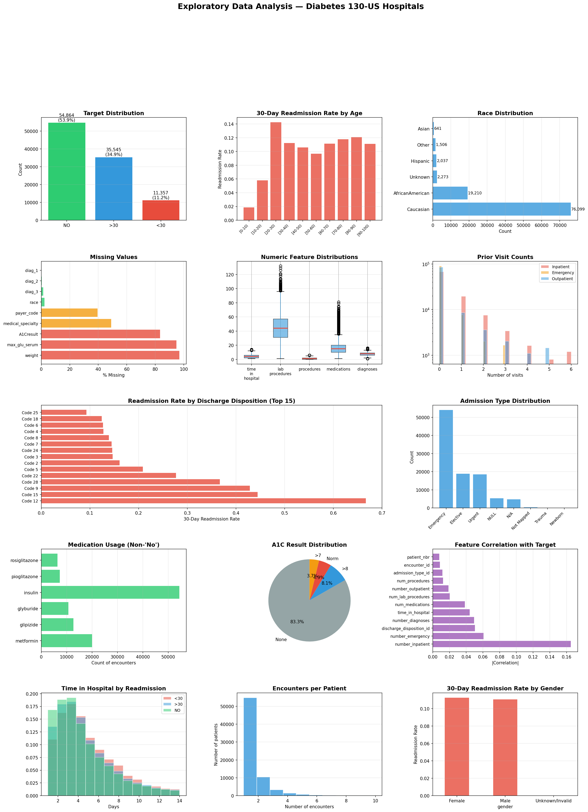
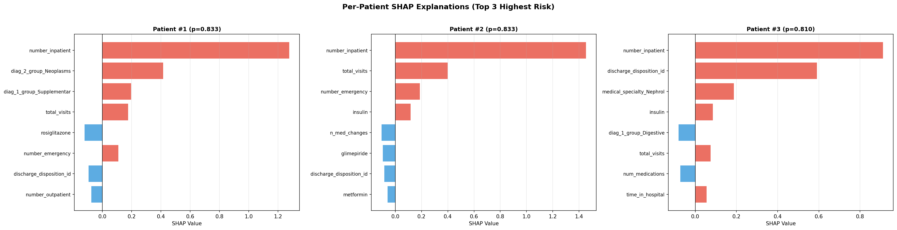

# 🏥 Hospital Readmission Risk Prediction

> **End-to-end ML pipeline that predicts 30-day readmission risk for diabetic patients across 130 U.S. hospitals — with calibrated risk tiers, SHAP explanations, and a fairness audit.**


---

##  Overview

Hospital readmissions within 30 days cost the U.S. healthcare system over **$26 billion annually**. Care-management resources — transition-of-care nurses, social workers, follow-up scheduling — are limited, so hospitals need a reliable way to prioritize which discharged patients most need intervention.

This project builds an **end-to-end proof-of-value (PoV) pipeline** that predicts 30-day readmission risk for diabetic patients, producing **calibrated risk scores**, **risk tiers**, and **per-patient explanations** that an intervention team can act on the same day.

**Team:** Feroz Khan · Matthieu Lafont · Henry Wolcott · Mustafa Yousaf

---

##  Dataset

| Property | Value |
|---|---|
| **Source** | [UCI ML Repository — Diabetes 130-US hospitals (1999–2008)](https://archive.ics.uci.edu/dataset/296/diabetes+130-us+hospitals+for+years+1999-2008) |
| **Rows** | 101,766 encounter-level records |
| **Hospitals** | 130 U.S. hospitals |
| **Raw features** | 50 (demographics, utilization, clinical proxies) |
| **Target** | Binary — 1 = readmitted within 30 days (~11.4%), 0 = otherwise |
| **Download** | `bash scripts/download_data.sh` |

---

##  Results

| Model | PR-AUC | ROC-AUC | Recall@10% | Lift@10% | Brier |
|---|:-:|:-:|:-:|:-:|:-:|
| Heuristic (prior visits) | 0.172 | 0.607 | 20.3% | 2.03× | 0.106 |
| Logistic Regression | 0.205 | 0.646 | 21.8% | 2.18× | 0.231 |
| Random Forest | 0.208 | 0.659 | 21.6% | 2.16× | 0.214 |
| **XGBoost (final)** | **0.221** | **0.663** | **22.2%** | **2.21×** | **0.098** |

- **5-Fold patient-grouped CV:** PR-AUC 0.222 ± 0.012, ROC-AUC 0.667 ± 0.007
- **Risk tiers:** High (22.7% readmit rate), Medium (12.8%), Low (6.8%)
- **Fairness:** No racial subgroup with ROC-AUC gap > 5 pp

### Model performance dashboard


### EDA dashboard


### SHAP — top reasons for highest-risk patients


---

##  Pipeline (14 phases)

1. **Data loading** — 101 K encounters from CSV
2. **Cleaning & leakage prevention** — remove death/hospice (2,423 rows), handle missing values, drop near-empty columns
3. **Feature engineering** — ICD-9 grouping (18 categories), ordinal age, medication encoding, 5 derived features → 109 features
4. **Patient-level split** — `GroupedStratifiedKFold`, zero patient overlap between train/test
5. **Baselines** — heuristic (prior-visit ranking) + Logistic Regression
6. **Model training** — Random Forest + XGBoost with 5-fold grouped CV
7. **Model comparison** — multi-criteria selection (PR-AUC primary)
8. **Calibration** — isotonic regression, Brier 0.215 → 0.098
9. **Risk tiers** — percentile-based Low / Medium / High with operational workflow
10. **SHAP explanations** — global feature importance + per-patient waterfall
11. **Fairness audit** — ROC-AUC, PR-AUC, Recall@10% by race
12. **Visualizations** — 8-panel dashboard + SHAP plots
13. **Scored output** — CSV with `risk_probability`, `risk_tier`, `top_3_reasons`
14. **Summary & model card**

---

##  Key Design Decisions

| Decision | Why |
|---|---|
| **Patient-level split** | All encounters for a given patient stay in the same fold — prevents identity leakage |
| **Death/hospice removed** | These patients cannot be readmitted; including them inflates apparent performance |
| **No oversampling** | Handled imbalance via PR-AUC primary metric + `scale_pos_weight` + threshold tuning |
| **ICD-9 grouping** | 500+ raw codes → 18 clinical categories, prevents sparse one-hot explosion |
| **Isotonic calibration** | Brier 0.215 → 0.098, makes risk-tier thresholds meaningful |
| **Race for auditing only** | Included in fairness analysis, excluded from production predictor |

---

##  Tech Stack

| Layer | Tools |
|---|---|
| **Data** | `pandas`, `numpy` |
| **Modeling** | `scikit-learn`, `xgboost` |
| **Explainability** | `shap` |
| **Calibration** | `sklearn.calibration.CalibratedClassifierCV` (isotonic) |
| **Viz** | `matplotlib`, `seaborn` |

---

##  Repository Structure

```
readmission-risk-prediction/
├── README.md
├── LICENSE
├── requirements.txt
├── notebooks/
│   ├── 01_EDA.ipynb
│   └── Readmission_Risk_Pipeline.ipynb
├── scripts/
│   └── download_data.sh
├── data/
│   ├── IDS_mapping.csv
│   └── raw/                              # gitignored — populated by script
├── reports/
│   ├── model_comparison.csv
│   └── scored_outreach_list.csv
├── images/
│   ├── eda_dashboard.png
│   ├── full_dashboard.png
│   └── shap_waterfall_top3.png
└── docs/
    ├── model_card.md
    ├── Full_Report.docx
    ├── Problem_Writeup.docx
    ├── Final_Presentation.pptx
    └── Final_Presentation_7min.pptx
```

---

##  Run It Locally

```bash
git clone https://github.com/ferozobaid/readmission-risk-prediction.git
cd readmission-risk-prediction
python -m venv .venv && source .venv/bin/activate
pip install -r requirements.txt
bash scripts/download_data.sh
jupyter lab notebooks/Readmission_Risk_Pipeline.ipynb
```

---

##  Future Improvements

- **External validation** — test transferability to MIMIC-IV or eICU cohorts
- **Temporal split** — train on 1999–2006, hold out 2007–2008, to mimic deployment
- **Cost-sensitive thresholds** — optimize a $-weighted utility, not just PR-AUC
- **Drift monitoring** — score-distribution + PSI alerts for production
- **Integration mock** — discharge-time API stub that surfaces the top-3 SHAP reasons in EHR

---

##  Disclaimer

Academic project — not validated for clinical production use. Predictions should not drive patient care decisions without independent validation in your local population.

---

##  Author

**Feroz Obaid Khan** — Master of Management Analytics, McGill University
🔗 GitHub: [@ferozobaid](https://github.com/ferozobaid)

##  License

Code: MIT — see [LICENSE](LICENSE). Dataset: UCI ML Repository under CC BY 4.0.
